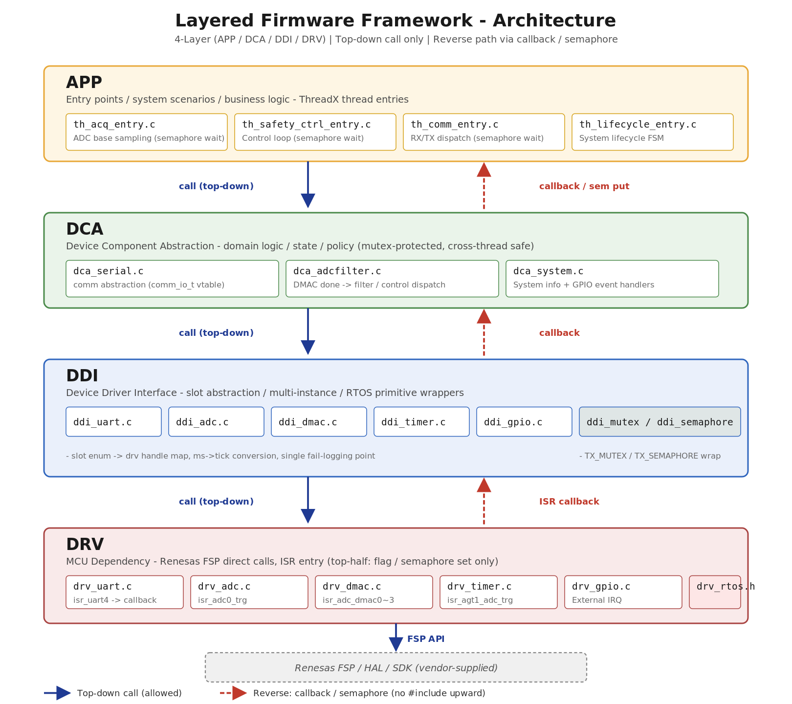

# Layered Firmware Framework — Portfolio Excerpt

> ThreadX 기반 임베디드 펌웨어의 **4-Layer 아키텍처 / ISR 최소화 / RTOS 동기화**
> 패턴을 발췌한 포트폴리오. 제품 식별 정보와 도메인 IP는 redact 처리되어 있으며,
> 컴파일은 되지 않지만 구조와 패턴을 그대로 읽을 수 있게 정리되어 있습니다.
>
> **Target MCU:** Renesas RA (FSP) · **RTOS:** Azure RTOS ThreadX
> **Original domain:** 의료기기 RF 제어 펌웨어 (IEC 62304 대응)

---

## Design Goals

- **Layer dependency direction enforcement** — APP → DCA → DDI → DRV 단방향
  호출. 하위 → 상위는 콜백 / 세마포어로만.
- **ISR execution time minimization** — ISR은 plain flag set 또는 semaphore
  put만. 실제 처리는 전부 RTOS task.
- **Thread-safe shared resource handling** — slot enum 기반 `ddi_mutex`로
  추상화, snapshot copy로 lock 구간 최소화.
- **Non-blocking communication architecture** — UART RX는 DTC + ring buffer
  + semaphore wakeup 조합. CPU는 수신 대기 중 다른 task 실행 가능.
- **Vendor isolation** — Renesas FSP 의존성은 `drv/` 1개 레이어에만 격리.
  MCU 교체 시 `drv/`만 교체.
- **Compile-time abstraction switches** — `D_USE_DDI_MUTEX`,
  `D_USE_TH_COMM` 등으로 하위 계층을 no-op 치환 가능.

---

## 레이어 구조

```
┌─────────────┐   ThreadX 스레드 엔트리, 비즈니스 정책
│    app/     │   ─ semaphore wait
└──────┬──────┘
       │ ↓ 호출            ↑ 콜백 / sem put
┌─────────────┐   도메인 컴포넌트 (상태머신, 필터)
│    dca/     │   ─ mutex로 cross-thread 보호
└──────┬──────┘
       │ ↓ 호출            ↑ 콜백
┌─────────────┐   Slot enum + RTOS primitive 래퍼
│    ddi/     │   ─ ms→tick 변환, 슬롯 검증
└──────┬──────┘
       │ ↓ 호출            ↑ ISR 콜백
┌─────────────┐   HAL 얇은 래퍼, ISR 진입점
│    drv/     │   ─ Renesas FSP 직접 호출
└──────┬──────┘
       │ ↓ FSP API
   ┌──────────────────────────┐
   │ Renesas FSP / HAL / SDK  │   (vendor-supplied)
   └──────────────────────────┘
```

레이어별 파일 매핑은 `docs/architecture.png` 참고.



---

## Patterns Showcased

### 1. Top-down call enforcement

하위 계층 헤더는 상위 계층을 `#include` 하지 않습니다. 역방향 통신은
**함수 포인터 등록**으로만:

```c
// drv/drv_dmac.c — ISR이 호출할 함수 포인터를 보관
static drv_dmac_callback_t cb_dmac[E_DRV_DMAC_HANDLE_MAX] = { NULL };
void drv_dmac_0_register_callback(drv_dmac_callback_t cb) { cb_dmac[0] = cb; }

// dca/dca_adcfilter.c — init 시점에 자기 핸들러를 주입
ddi_dmac_0_handle(on_dmac0_done);     // 하위 → 상위 의존성 0
```

### 2. ISR top-half / Bottom-half split

DMAC 완료 ISR은 단 한 줄로 종료. 실제 필터링은 task에서:

```c
// dca/dca_adcfilter.c — ISR context (수십 μs)
static void on_dmac0_done(void) { filterFlag[E_DCA_FILTER_CH_A].fullFlag = true; }

// 1ms AGT1 ISR — semaphore put만으로 task 깨우기
static void on_agt1_tick_1ms(void) {
    (void)ddi_semaphore_put(E_DDI_SEMAPHORE_ADC_CTRL_DONE);
    if (++adcTick1ms >= 10U) {
        adcTick1ms = 0; adcTick10ms++;
        (void)ddi_semaphore_put(E_DDI_SEMAPHORE_ADC_BASE_DONE);
    }
}

// app/th_safety_ctrl_entry.c — task context (bottom-half)
for (;;) {
    ddi_semaphore_get(E_DDI_SEMAPHORE_ADC_CTRL_DONE, FALLBACK_MS);
    dca_system_poll_all_inputs();        // 무거운 작업은 여기서
    dca_adcfilter_run_ctrl_loop();
}
```

### 3. Slot enum + RTOS primitive 추상화

상위 계층은 `E_DDI_MUTEX_SYSTEM_INFO` 같은 의미 있는 이름만 다루고,
`TX_MUTEX*` 직접 노출은 `ddi_mutex.c` 한 곳에서만 발생합니다.
ms→tick 변환, fail 로깅, 컴파일 타임 no-op 처리도 같은 자리에 모입니다:

```c
// ddi/ddi_mutex.c
fw_status_t ddi_mutex_get(ddi_mutex_slot_e slot, uint32_t timeout_ms) {
    TX_MUTEX* m = get_handle(slot);
    if (m == NULL) { error("invalid slot=%d", slot); return FW_FAIL; }
    UINT s = tx_mutex_get(m, ms_to_ticks(timeout_ms));
    if (s != TX_SUCCESS) { error("get fail tx_status=%u", s); return FW_FAIL; }
    return FW_OK;
}
```

### 4. Snapshot copy for cross-thread read

공유 자료는 짧은 lock 구간에서 struct 통째 복사 → lock 해제 후 사용.
호출자는 lock 의식 없이 안전:

```c
// dca/dca_adcfilter.c
fw_status_t dca_adcfilter_get_snapshot(dca_adcfilter_info_t* out) {
    if (out == NULL) return FW_FAIL;
    lock_adcfilter_info();
    memcpy(out, &adcfilterInfo, sizeof(*out));   // 마이크로초 lock window
    unlock_adcfilter_info();
    return FW_OK;
}
```

### 5. DTC + Ring buffer + Non-blocking UART

UART RX는 DTC가 38바이트씩 채워주고, ISR은 ring buffer로 복사 → 즉시
re-arm → semaphore put. CPU는 수신 대기 중 다른 task 실행:

```c
// ddi/ddi_uart.c — ISR top-half
static void on_rx_complete_dtc(void) {
    for (uint32_t i = 0; i < D_COMM_DTC_BLOCK_SIZE; i++) { ... }  // copy
    (void)drv_uart_read(E_DRV_UART_LCD, dtc_rx_buf, D_COMM_DTC_BLOCK_SIZE);  // re-arm
    (void)ddi_semaphore_put(E_DDI_SEMAPHORE_UART_RX_READY);                  // wake
}
```

### 6. Data-driven GPIO with debounce

핀 별 polarity / debounce / log 이름을 하나의 테이블로 관리. 새 핀 추가는
한 줄:

```c
// ddi/ddi_gpio.c
static const ddi_gpio_config_t gpioConfigTable[E_DDI_GPIO_PORT_MAX] = {
    [E_DDI_GPIO_IN_POWER_SW]    = { &deb_power_sw, HIGH, "POWER_SW" },
    [E_DDI_GPIO_IN_FOOT_SW]     = { &deb_foot_sw,  LOW,  "FOOT_SW"  },
    ...
};
```

---

## File Index

| Layer | File | Role |
|-------|------|------|
| **APP** | `th_acq_entry.c`         | 10ms 슬로우 ADC 수집 thread |
|    -    | `th_safety_ctrl_entry.c` | 1ms 안전/제어 thread |
|    -    | `th_comm_entry.c`        | UART RX/TX dispatch thread |
| **DCA** | `dca_serial.c`           | comm_io_t vtable + 패킷 codec |
|    -    | `dca_adcfilter.c`        | DMAC ISR + 필터 + snapshot ⭐ |
|    -    | `dca_system.c`           | GPIO 이벤트 + 시스템 정보 snapshot |
| **DDI** | `ddi_uart.c`             | DTC ring buffer + 세마포어 wakeup |
|    -    | `ddi_adc/dmac/timer/gpio.c` | drv_* slot enum 래퍼 |
|    -    | `ddi_mutex.c`            | TX_MUTEX slot 추상화 |
|    -    | `ddi_semaphore.c`        | TX_SEMAPHORE slot 추상화 (ISR-safe put) |
| **DRV** | `drv_uart.c`             | `R_SCI_UART_*` + isr_uart0/4 |
|    -    | `drv_adc.c`              | `R_ADC_*` + isr_adc0_trg |
|    -    | `drv_dmac.c`             | `R_DMAC_*` + isr_adc_dmac0~3 |
|    -    | `drv_timer.c`            | `R_GPT/AGT_*` + isr_agt1_adc_trg |
|    -    | `drv_gpio.c`             | `R_IOPORT_*` |
|    -    | `drv_rtos.h`             | `tx_api.h` re-export (DRV+ddi_mutex/sem 전용) |
| **support** | `tools/fw_types.h`       | 공통 enum / fw_status_t |
|    -    | `tools/common.h`         | error/info/timext (declaration only) |
| **docs** | `docs/architecture.svg/.png` | 4-Layer 블록 다이어그램 |

---

## Notes for Reviewers

- **컴파일 불가**: FSP / BSP 의존성 (`r_sci_uart_api.h`, `tx_api.h` 등) 제거,
  도메인 임계값·캘리브레이션·프로토콜 magic도 redact. 본 레포는
  **구조와 패턴을 읽기 위한 자료** 입니다.
- **FSP 함수명 노출 의도**: `R_SCI_UART_Open`, `R_ADC_ScanStart`, `R_GPT_*`
  등 벤더 API를 그대로 보여 — DRV 레이어가 벤더 의존성을 한 곳에 격리하는
  포지셔닝을 명확히 하기 위함.
- **th_lifecycle 스레드**: 다이어그램에는 4번째 thread로 표시되어 있으나
  본 발췌에서는 코드 생략. 시스템 라이프사이클 FSM 자체가 도메인 로직과
  강하게 결합되어 일반화가 어려움.
- **`/* tuning value redacted */`** 주석으로 표시된 부분: 의료기기 안전
  관련 임계값, 캘리브레이션 테이블, 프로토콜 STX/ETX 등.

원본 코드 베이스 약 4,500 LoC 중 **레이어드 아키텍처의 핵심 골격
약 1,200 LoC** 를 발췌·일반화했습니다.
